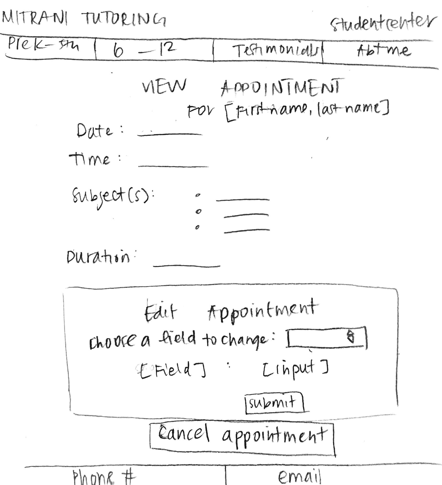

# Project 4: Design Journey

Your Team Name: [Gray-Giraffe]

**All images must be visible in Markdown Preview. No credit will be provided for images in your repository that are not properly linked in Markdown. Assume all file paths are case sensitive!**


## Client Description

[Tell us about your client. Who is your client? What kind of website do they want? What are their key goals?]

[NOTE: If you are redesigning an existing website, give us the current URL and some screenshots of the current site. Tell us how you plan to update the site in a significant way that meets the final project requirements.]

Our client is Laurie Mitrani, a certified teacher and UVA grad. She is an educational consultant and tutor who wishes to have a website in which families can view her educational services for elementary age through high school students. Currently, most of her clients are found through word of mouth, so with a website that has information about her work, she can hopefully expand her client network with greater reach and exposure.

## Meeting Notes

[By this point, you have met once with your client to discuss all their requirements. Include your notes from the meeting, an email they sent you, or whatever you used to keep track of what was discussed at the meeting. Include these artifacts here.]

 Our client meeting notes are included on the following google document:
 https://docs.google.com/document/d/1viX_9RcYsVAC91IHfR2XvH-lHVhr6DNDR1_88FB-sKU/edit?usp=sharing

## Purpose & Content

[Tell us the purpose of the website and what it is all about.]

The purpose of this website is to give Laurie's company/tutoring business and online presence. She currently gets business through word of mouth, but the website will allow anybody to learn about the educational services she offers, her experience, and allow them to get in contact with Laurie if they are interested. The site will include testimonials, a brief bio, and descriptions of the services that she offers, grouped by age group.

## Target Audience(s)

[Tell us about the potential audience for this website. How, when, and where would they interact with the website? Get as much detail as possible from the client to help you find representative users.]

The target audience for this website are potential and existing clients of Laurie. For potential clients, this site will serve as an advertisement and endorsement to Laurie's tutoring services and qualifications. Potential clients will most likely be the parents of children that are in need of educational tutoring. Existing clients will be able to view existing and make new appointments.


## Client Requirements & Target Audiences' Needs

[Collect your client's needs and wants for the website. Come up with several appropriate design ideas on how those needs may be met. In the **Rationale** field, justify your ideas and add any additional comments you have. There is no specific number of needs required for this, but you need enough to do the job.]

Example:
- Target Audience Need
  - **Requirement or Need** [What does your client and audience need or want?]
    - Potential clients need to what specific services are available for their children
  - **Design Ideas and Choices** [How will you meet those needs or wants?]
    - Create pages for different age groups with details about the specific services offered for that age group
  - **Rationale** [Justify your decisions; additional notes.]
    - Rather than listing all of the services for all children preschool to high school in one place, this split will make it easier and more clear for potential clients to get a better understanding about what exactly will be offered to their child.
- Target Audience Need
  - **Requirement or Need** [What does your client and audience need or want?]
    - Potential clients need to know why they should pick Laurie as their tutor
  - **Design Ideas and Choices** [How will you meet those needs or wants?]
    - Create an about page that lists Laurie's qualifications, as well as a page with testimonials from prior/existing clients
  - **Rationale** [Justify your decisions; additional notes.]
    - Listing Lauries qualifications, as well as adding testemonials will build up her brand, and show potential clients that they should hire her.
- Target Audience Need
  - **Requirement or Need** [What does your client and audience need or want?]
    - Existing clients need to know when they are scheduled to meet with Laurie
  - **Design Ideas and Choices** [How will you meet those needs or wants?]
    - Create a page where users can sign in and view their existing appointments as well as make new ones
  - **Rationale** [Justify your decisions; additional notes.]
    - Creating a seperate page for users to log in will make it easy for existing clients to keep track of tutoring appointments.


## Initial Design

### Initial card sort


### Exploratory sketches

Home

Prek/Elementary and 6th/12th

Testimonials

About

Student center


## Information Architecture, Content, and Navigation

[Lay out the plan for how you'll organize the site and which content will go where. Note any content (e.g., text, image) that you need to make/get from the client.]

Content waiting to get from client:
- 1 picture of her (for the ‘About Me’ page)
- Photos of her working with students
- A description of herself and her experience (also for the ‘About Me’ page)
- Description of the services offered for preschool/elementary students and middle/high school students


[Document your process, we want to see how you came up with your content organization and website navigation. Note: There is no specific amount to write here. You simply need enough content to do the job.]

- **Navigation**
  - Home (as title head)
  - Pre-K - 5th
  - 6th - 12th
  - Testimonials
  - About Laurie
  - Student Center: Login to make appt with/delete appt with laurie


- **Content** (List all the content corresponding to main navigation and sub-categories.)
  - Home
    - Header title
    - (Slideshow?) Images of Laurie working with her students
    - About the site and the organization
    - Kinds of services offered
    - Why tutoring is important
    - IF LOGGED IN: show testimonial form
    - Footer (contact information)
  - Pre-K - 5th
    - Header title
    - Image with pre-k - 5th students
    - Information about services for pre-k - 5th students only
    - Link to testimonial page with pre-k - 5th filter
    - IF LOGGED IN: show testimonial form
    - Footer (contact information)
  - 6th - 12th
    - Header title
    - Image with 6th - 12th grades students
    - Information about services for 6th - 12th grades students only
    - Link to testimonial page with 6th - 12th grades filter
    - IF LOGGED IN: show testimonial form
    - Footer (contact information)
  - Testimonials
    - Header title
    - Brief information about testimonials coming from students
    - Interactive sorting form functions for the database table
    - Testimonials table
      - Link to view testimonial on separate full page
        - single_testimonial.php
      - Preview of testimonial with snapshot (testimonial)
      - Rating out of 5 stars (rating)
      - Grade of user who submitted (age group)
      - year submitted (date)
    - Notification to login to submit a testimonial
    - IF LOGGED IN: show testimonial form
    - Footer (contact information)
  - About Laurie
    - Header title
    - Blurb bio with headshot
    - More detailed background experience (like resume?)
    - Links to media like LinkedIn, examples of work, etc.
    - Contact information: phone, email
    - Footer (contact information)
  - Student Center: also show username if logged in
    - Header title
    - IF NOT LOGGED IN: show login and info that you must login to access certain materials
    - IF LOGGED IN:
      - Welcome to student center
      - View appointments + cancel
        - each appointment links to a single_appointment page where they can edit and cancel the appointment
          - Change appointment
          - Cancel appointment
      - Schedule appointment
      - testimonial form
    - Footer (contact information)
  - Single appointment
    - Header
    - Change appointment
    - Cancel appointment
    - Footer
  - Single testimony
    - Header
    - Full testimony
    - student info
    - footer

- **Process**
  - Card sort
    - header and footer are on all pages
    - images with students on home, prek-5th, 6-12
      - primarily used at top of page
      - other pages may have other images
    - submit testimonial form on home, prek-5th, 6-12, testimonials, and student center IF logged in
      - the form is most relevant on each of these pages


- Additional notes about organization/card sort:
  - The single testimony page is meant to display full, longer testimonials which the tables preview with shorter blurbs. This so that the table of testimonials does not become excessively long with large cells
  - The single appointment page is linked to from the view appointments on the student center. This makes it easier to edit and cancel specific appointment based on appointment id

Additional page exploratory sketches:

Single appointment

Single testimony


## Interactivity

[What interactive features will your site have? What PHP elements will you include?]

[Also, describe how the interactivity connects with the needs of the clients/target audience.]

1) We will have a page where the user can sign in, and view their existing appointments, make new appointments, edit appointments, as well as cancel appointments. This page will be userful to existing clients as they will have one central place to keep track of all information regarding tutoring appointments. To implement this page, we will have to implement the login/logout feature, by creating session cookies and a table with user ids and their corresponding hashed passwords. To make a new appointment, there will be a form that the user can fill out. When the form is submitted, we will check that that specific time is available, and then insert the new appointment information into the database. Each appointment will also have a corresponding button where the user can cancel the appointment.

2) On the testimonials page, we will have a feature where the user can sort the testimonials. They will be able to sort by date, rating, and age group. This is important for potential clients, as they want to know whether this tutor is reputable. To implement this feature, we will have a drop down menu, where users can sort by specific tags.

3) On the testimonials and student center page, we will have a form so logged in users can submit testimonials. This is to ensure that only actual clients of Laurie can submit testimonials if they have proper login credentials. Once users submit testimonials, they will be added to the testimonials database table and show on the testimonials page.

## Work Distribution

Each person will be assigned 2-3 pages to be in charge of for design and coding. We will create a consistent header, nav, and footer for all pages. Ellie and Lucy will alternate to be in charge of sending direct correspondence with the client, while we all contribute and keep track of client/site notes on a shared google document for review and on this design journey. For each milestone, we will also divide up the sections evenly if possible. Jamie will be more focused on design while Ellie will be more focused on technical task division and Lucy in charge of task management; however, we will all contribute to and provide feedback for all aspects. If anyone is falling behind or needs help, we will communicate and actively offer assistance/guidance where necessary. We will all make sure we are coding and designing evenly among our members.

## Additional Comments

[If you feel like you haven't fully explained your design choices, or if you want to explain some other functions in your site (such as special design decisions that might not meet the final project requirements), you can use this space to justify your design choices or ask other questions about the project and process.]


--- <!-- ^^^ Milestone 1; vvv Milestone 2 -->

## Client Feedback

[Share the feedback notes you received from your client about your initial design.]

Overall our client was very happy with the initial design of our website. She was particularly excited about the design of the student center and the ability for each user to login and view their scheduled appointments and update or cancel the appointments as needed. She also gave us positive feedback for the testimonials page and liked the fact that potential clients in her target audience would be able to have insight into other clients' experiences. Our client liked the structure of the site, however she asked that the page that included information on her services not include the actual rates that she charges. Her rates vary from client to client, so we changed the pricing information to 'competitive rates.'

One comment that Laurie had was that she wanted to be able to view the appointments for all of her students in one place, so that she is aware of what appointments she has each day.


## Iterated Design

[Improve your design based on the feedback you received from your client.]

One of the things that we realized while corresponding with our client is that there isn't too much content to fill the pre-k-5th, 6th-12th grade pages, as well as the testimonial page. So, we added special links for each page that led to the testimonials with a filter for all the relevant grades.

- Add available locations to tables/appointments
- Make 1 hour time slots only for appointments
- Hours from 9 am - 7 pm
- Capitalize all headings
- If a user uploaded a testimonial, they should be able to delete it

To allow Laurie to view all of her scheduled appointments in one place, we implemented an admin user. When Laurie signs in to the student center as an admin, she is able to view all scheduled appointments, as well as details about who the student is, their grade, contact information. She is also able to view where, when, and at what time the appointment is scheduled. She had the ability to delete appointments as well, incase a student tells Laurie that they need to cancel an appointment but forget to cancel the appointment on their own student center page.

## Evaluate your Design

[Use the GenderMag method to evaluate your wireframes.]

[Pick a persona that you believe will help you address the gender bias within your design.]

I've selected **[Abby]** as my persona.

I've selected my persona because... [Tell us why you picked your persona in 1-3 sentences. Your explanation should include why your persona will help you address gender-inclusiveness bugs in your design.]

I've selected Abby as my persona as she fits the persona that may be similar to many parents who are trying to book appointments with Laurie. A good portion of the target audience for this site, such as stay-at-home moms, may not have high computer self-efficacy. Furthermore as the intent for this site is to be as accessible to a variety of families, in order to increase Laurie's flow of business.

### Tasks

[You will need to evaluate at least 2 tasks (known as scenarios in the GenderMag literature). List your tasks here. These tasks are the same as the task you learned in INFO/CS 1300.]

[For each task, list the ideal set of actions that you would like your users to take when working towards the task.]

Task 1: [Book an appointment with Laurie]

  1. [Log into the Student Center]
  2. [Fill out date, time, subject, and duration for appointment]
  3. [Hit submit]

Task 2: [Cancel an appointment with Laurie]

1. [Log into the Student Center]
2. [Hit cancel]

### Cognitive Walkthrough

[Perform a cognitive walkthrough using the GenderMag method for all of your Tasks. Use the GenderMag template in the <documents/gendermag-template.md> file.]

#### Task 1 - Cognitive Walkthrough

[copy the GenderMag template here and conduct a cognitive walkthrough to evaluate your design (wireframes).]

[You may need to add additional subgoals and/or actions for each task.]

**Task name: [Book an appointment with Laurie]**

[Add as many subgoals as you needs]
**Subgoal # [1] : [Get to the 'create appointment' form]**
	(e.g., "# 1 : Select the section of the document you want to print")

  - Will [persona name] have formed this sub-goal as a step to their overall goal?
    - Yes, maybe or no: [yes]
    - Why? (Especially consider [persona name]'s Motivations/Strategies.)
    Getting to a form to create and submit information is something universal to many websites and tasks, such as booking a doctor's appointment, so Abby will most likely have thought of this.

[Add as many actions as you need...]
**Action # [1] : [Log into Student Center]**
	(e.g., "# 1 : Put the mouse at the beginning of the section you want to print")

  - Will [persona name] know what to do at this step?
    - Yes, maybe or no: [maybe]
    - Why? (Especially consider [persona name]'s Knowledge/Skills, Motivations/Strategies, Self-Efficacy and Tinkering.)
  Abby may not know that the way to get to the appointment form is through logging into her student center, as the form is not obviously placed on a separate tab or page.

  - If [persona name] does the right thing, will she know that she did the right thing, and is making progress towards her goal?
    - Yes, maybe or no: [yes]
    - Why? (Especially consider [persona name]'s Self-Efficacy and Attitude toward Risk.)
Once logged into student center, the form to create an appointment appears and has intuitive input labels.
**Subgoal # [2] : [Complete the form]**
	(e.g., "# 1 : Select the section of the document you want to print")

  - Will [persona name] have formed this sub-goal as a step to their overall goal?
    - Yes, maybe or no: [yes]
    - Why? (Especially consider [persona name]'s Motivations/Strategies.)
    Filling out a form with the correct information is something universal to creating any appointment, so Abby will have likely formed this sub-goal.

[Add as many actions as you need...]
**Action # [2] : [Enter date, time, subject, and duration]**
	(e.g., "# 1 : Put the mouse at the beginning of the section you want to print")

  - Will [persona name] know what to do at this step?
    - Yes, maybe or no: [yes]
    - Why? (Especially consider [persona name]'s Knowledge/Skills, Motivations/Strategies, Self-Efficacy and Tinkering.)
  The input labels are clearly marked, and Abby will understand to mark the fields accordingly.

  - If [persona name] does the right thing, will she know that she did the right thing, and is making progress towards her goal?
    - Yes, maybe or no: [yes]
    - Why? (Especially consider [persona name]'s Self-Efficacy and Attitude toward Risk.)
There is form feedback to let her know if she has completed the fields correctly.

**Action # [3] : [Hit submit]**
	(e.g., "# 1 : Put the mouse at the beginning of the section you want to print")

  - Will [persona name] know what to do at this step?
    - Yes, maybe or no: [yes]
    - Why? (Especially consider [persona name]'s Knowledge/Skills, Motivations/Strategies, Self-Efficacy and Tinkering.)
  Once the form has been filled out, it is the natural next step to submit the form. Abby will have done this on other forms she has used in the past.

  - If [persona name] does the right thing, will she know that she did the right thing, and is making progress towards her goal?
    - Yes, maybe or no: [yes]
    - Why? (Especially consider [persona name]'s Self-Efficacy and Attitude toward Risk.)
There is form feedback to let her know that her appointment has been created and she will be able to view her appointment on her student center.
#### Task 2 - Cognitive Walkthrough
**Task name: [Cancel an appointment]**

[Add as many subgoals as you needs]
**Subgoal # [1] : [Get to the appointment that has been canceled]**
	(e.g., "# 1 : Select the section of the document you want to print")

  - Will [persona name] have formed this sub-goal as a step to their overall goal?
    - Yes, maybe or no: [yes]
    - Why? (Especially consider [persona name]'s Motivations/Strategies.)
    Abby has an appointment in mind that she wishes to cancel, and will need to access this appointment specifically. This is a subogal she has had experience with in canceling appointments for other areas.

[Add as many actions as you need...]
**Action # [1] : [Log into Student Center]**
	(e.g., "# 1 : Put the mouse at the beginning of the section you want to print")

  - Will [persona name] know what to do at this step?
    - Yes, maybe or no: [maybe]
    - Why? (Especially consider [persona name]'s Knowledge/Skills, Motivations/Strategies, Self-Efficacy and Tinkering.)
  Since the information is personal to Abby, she will most likely know that she has to log in to view the appointment

  - If [persona name] does the right thing, will she know that she did the right thing, and is making progress towards her goal?
    - Yes, maybe or no: [yes]
    - Why? (Especially consider [persona name]'s Self-Efficacy and Attitude toward Risk.)
Her appointment that she wishes to cancel can be easily viewed once she logs into the student center.
**Subgoal # [2] : [Clear the appointment]**
	(e.g., "# 1 : Select the section of the document you want to print")

  - Will [persona name] have formed this sub-goal as a step to their overall goal?
    - Yes, maybe or no: [yes]
    - Why? (Especially consider [persona name]'s Motivations/Strategies.)
    If she wishes to cancel a certain appointment, it will be realtively intuitive to Abby to want to clear it off of her appointments section.

[Add as many actions as you need...]
**Action # [2] : [Hit 'cancel appointment' button]**
	(e.g., "# 1 : Put the mouse at the beginning of the section you want to print")

  - Will [persona name] know what to do at this step?
    - Yes, maybe or no: [yes]
    - Why? (Especially consider [persona name]'s Knowledge/Skills, Motivations/Strategies, Self-Efficacy and Tinkering.)
  The cancel appointments button is clearly marked under the given appointment.

  - If [persona name] does the right thing, will she know that she did the right thing, and is making progress towards her goal?
    - Yes, maybe or no: [yes]
    - Why? (Especially consider [persona name]'s Self-Efficacy and Attitude toward Risk.)
There is a form message to let her know that she has canceled her appointment successfully and she will no longer be able to view the canceled appointment in her appointments section.


### Cognitive Walk-though Results

[Did you discover any issues with your design? What were they? How will you change your design to address the gender-inclusiveness bugs you discovered?]

[Your responses here should be **very** thorough and thoughtful.]

An issue that was brought to our attention was the need for clear and constant feedback to the user. In order to let the user know that they have successfully made changes to their appointments, such as adding or canceling an appointment. If there is no feedback for the user, they may or may not know that they have accomplished these tasks successfully, other than the fact that they will be able to view new appointments in their student center or can no longer view an appointment that they canceled.

Another design issue that was discovered through the cognitive walkthrough was the possibility of Abby not knowing how to access the 'create appointment' form. Therefore we will include a message at the top of the Student Center page that prompts the user to log in in order to schedule an appointment.

A similar design issue that came up from task 2, was needing to be able to log in to the student center to have the ability to delete an appointment. To address this design issue, we will also include a note at the top of the student center page to log in to delete an appointment.

## Final Design
Updated sketches:

About Me

Testimonials


PreK-5

6-12

[What changes did you make to your final design based on the results on your cognitive walkthrough?]
- More consistency for easier understanding and use
- better use of images to draw in users
- added feedback to forms so users know if they have successfully completed tasks
- better descriptions on tops of pages, including the student center that says once you login, you can schedule/edit/view/cancel appointments and submit testimonials
- better use of colors that resemble academic life, such as greens, blues, chalkboard grey/black, white, and red
- red asterisks next to required form inputs help guide users to know what parts are required
- links are usually red and change color to blue upon hover
- testimonials table is sorted according to the order that makes sense (i.e. grades filter is ascending, table is usually ordered by most recent date which most prospective users would prefer)
- once users sign in, the student center tab appears in the nav while "Sign out [user name]" is at the top corner for easy signout UX.
- custom testimonial links on the Prek-5 and 6-12 pages are useful for prospective tutees, who are most likely to look at those sites, to learn more
- added 'sign in' at the top with student center to make the affordance clearer. The entire link changes color upon hover, so users know to click on it as a whole.

## Database Schema

[Describe the structure of your database. You may use words or a picture. A bulleted list is probably the simplest way to do this.]

Image of table planning:


Final Table Sketches:


Table: users
* field 1: id INTEGER NOT NULL PRIMARY KEY AUTOINCREMENT UNIQUE
* field 2: username TEXT NOT NULL UNIQUE
* field 3: password TEXT NOT NULL
* field 4: first_name TEXT NOT NULL
* field 5: last_name TEXT NOT NULL
* field 6: grade INTEGER
* field 7: home TEXT
* field 8: school TEXT
* field 9: email TEXT
* field 10: phone TEXT

Table: sessions
* field 1: id INTEGER NOT NULL PRIMARY KEY AUTOINCREMENT UNIQUE
* field 2: user_id INTEGER NOT NULL
* field 3: session TEXT NOT NULL UNIQUE

Table: appointments
* field 1: id INTEGER NOT NULL PRIMARY KEY AUTOINCREMENT UNIQUE
* field 2: date TEXT NOT NULL
* field 3: time_start TEXT NOT NULL
* field 4: time_end TEXT NOT NULL
* field 5: location TEXT NOT NULL
* field 6: comment TEXT,
* field 7: user_id INTEGER NOT NULL

Table: appointment_subjects
* field 1: id INTEGER NOT NULL PRIMARY KEY AUTOINCREMENT UNIQUE
* field 2: appointment_id INTEGER NOT NULL
* field 3: subject_id INTEGER NOT NULL

Table: subjects
* field 1: id INTEGER NOT NULL PRIMARY KEY AUTOINCREMENT UNIQUE
* field 2: subject TEXT NOT NULL UNIQUE

Table: testimonials
* field 1: id INTEGER NOT NULL PRIMARY KEY AUTOINCREMENT UNIQUE
* field 2: testimonial TEXT NOT NULL
* field 3: rating INTEGER NOT NULL
* field 4: date TEXT NOT NULL
* field 5: role TEXT NOT NULL
* field 6: user_id INTEGER

## Database Queries

[Plan your database queries. You may use natural language, pseudocode, or SQL.]

To get existing appointment:
  Select all appointments from the Appointment table where the user_id is equal to the one of the user who is signed in
To make an appointment:
  Insert date, time, location, comment, current user id into the appointments table
  insert appointment_ids and subject_ids into appointment_subjects table
To add a testimonial
  Insert current user id, testimonial, rating, date, and role into the testimonial table (and anonymous)
To sort testimonials
  Select all of the testimonials in the table that match the selected rating/date/user grade/role

- If user cancels appointment: "DELETE FROM appointment_subjects WHERE appointment_id = :appt_id;";
- If user makes an appointment: "INSERT INTO appointment_subjects (appointment_id, subject_id) VALUES (:appt_id, :subj_id);";
- If user updates appointment field (date, time, subject, location, comments): "UPDATE appointments SET location = :new_location WHERE id = :appt_id"; (for each respective field)
- If user submits a testimony: "INSERT INTO testimonials (testimonial, rating, date, role, user_id) VALUES (:testimonial, :rating, :date, :role, :user_id)";
- Delete appointments that have passed: "SELECT DISTINCT appointments.id, appointments.date, appointments.time_start, appointments.time_end, appointments.location,   appointments.comment FROM appointments
  JOIN appointment_subjects ON appointments.id = appointment_subjects.appointment_id
  JOIN subjects ON appointment_subjects.subject_id = subjects.id
  WHERE appointments.user_id = :user_id
  ORDER BY appointments.date";

## PHP File Structure

[List the PHP files you will have. You will probably want to do this with a bulleted list.]

* includes/init.php - stuff that useful for every web page.
* includes/header.php- header for each page
* includes/footer.php- footer for each page
* index.php- main page
* k-5th.php- info about k-5th grade services
* 6-12.php- info about 6-12th grade services
* testimonials.php- student/parent testimonials about Laurie's services
* about.php- info about Laurie
* studentcenter.php- info for existing students about appointments

## Pseudocode

[For each PHP file, plan out your pseudocode. You probably want a subheading for each file.]

### index.php

```
include init.php, header.php
if user is logged in
  show testimonial form (include testimonial_form.php)
else if user is logged out
  show link to testimonies
include footer.php

```
### header.php
```
if the current page is "Pre-K - 5th":
  underline "Pre-K - 5th" in the nav bar
if the current page is "6th - 12th":
  underline "6th - 12th" in the nav bar
if the current page is "Testimonials":
  underline "Testimonials" in the nav bar
if the current page is "About Me":
  underline "About Me" in the nav bar
if the user is logged in:
  show the sign out link (display: "Sign Out ___username___" )
```
### k-5.php
```
n/a
```

### 6-12.php
```
n/a
```

### testimonials.php
```
include init.php
PHP FOR SORT BY:
  if GET submit_sortby:
    get values for date, grade, rating, and role IF isset()
    filter values for date, grade, rating and role
    SQL query for those specified values from testimonials database
    show table with sql query
  else:
    SQL query for all values from testimonials database
    show table with sql query
PHP FOR SORT BY SELECT-OPTIONS:
  get all the records from data for specified label (i.e. date)
  save records as $all_LABELS
  for loop through records to create options
PHP FOR TESTIMONIALS:
  if user is logged in
    show testimonial form (include testimonial_form.php)
  else if user is logged out
    show link to login to submit testimonials
  include footer.php

```
### about.php
```
include init.php, header.php, footer.php
```
### studentcenter.php
```
include init.php, header.php
if no user is logged in:
  display: "Sign in to view existing appointments, schedule an appointment, or cancel an appointment."
  display the login form
if a user is logged in:
  display: "Welcome Back ___username___!"
  show existing appointments
  display the form to make a new appointment
if the login form is submitted:
  refresh the page to show the contents for a signed in user
if the new appointment form is submitted:
  make a new appointment (sql)
  display text confirming that the appointment was made
  update the "existing appointments" information
include footer.php
```

### single_appointment.php
```
include init.php, header.php
if the admin is logged in:
  display date,time,name of student,grade,subjects,location,comments,email,phone
else if a user is logger in:
  display appointment information
  allow user to modify appointment
    if location is selected
      change location
    if date is selected
      change date
    if time is selected
      change time
    if comment is selected
      change comment
    if subjects are selected
      change subjects
include footer.php
```

### footer.php
  n/a

### testimonial_form.php
```
if isset(submit):
  current user = current user first name, last name
  grade = current user grade
  date = date(YYYY)

  testimonial = get+filter textarea
  rating = get+filter rating number
  role = get+filter option for parent/student

  if all set:
    insert into testimonials:
      user_id = current user id
      testimonial
      rating
      date
      role

      if successful:
        show success message thank you
      else:
        show error message
  else:
    show error message
```

### single_testimonial.php
```
if (user is logged in and is the author of the testimony):
  if isset(cancel button):
    delete the testimonial
    redirect the user to the testimonial page
    display success message that the testimony was infact deleted
```

### single_student.php
```
if admin is logged in:

display student info where student = user_id
  echo Name
  echo Grade
  echo School
  echo Home Address
  echo Email
  echo Phone Number
```
## Additional Comments

NOTES:
- will update other pages to better match final design sketches and for consistency in next milestone (will be easier with databases)

TO DO:
- init.php function with php for testimonial_form.php
- testimonials.php needs php for sort by
- include testimonials database for table in testimonials.php
- update testimonial_form.php css
- update single pages with php and sql

--- <!-- ^^^ Milestone 2; vvv Milestone 3 -->

## Issues & Challenges

[Tell us about any issues or challenges you faced while trying to complete milestone 3. Bullet points preferred.]
- Querying for the appointment form did not work because of the format of the date and time, we fixed this by using military time and printing in am/pm
- Submitting multiple subjects in the appointments table, we realized that the error was resetting the lastInsertId for each subject
- we re-structured our database and queries to get valid appointment times (unlike static time slots we used initially)
  - As we got further into the project, and thought more about how to prevent scheduling duplicate appointments, we realized that our database structures were very inefficient
  - We had a times table, that was seeded with appointment times, in 1hr intervals (3-4, 4-5, etc). Each appointment entry also had a "date" field, as well as an "available" field which contained information about whether the appointment was taken. We realized that this was both inefficient for users and our client.
    - Users would be limited to booking appointments at certain times (ex. only 4-5pm and not 4:15-5:15pm)
    - Our client would have to update the table, because we wouldn't be able to manually seed times slots for every single day for a large number of days, or the database would be too large.
    - The main reason we initially thought about designing the times table this was was so prevent users from scheduling appointments outside of Laurie's working hours
      - We realized that this could easily be done by putting constraints on the form inputs (hours 9am-7pm, no saturday appointments)
  - we ended up just deleting the times table and modifying the appointments table to include the dates
  - because we realized this so late, we had to restructure a lot of the queries that dealt with appointments
- Another issue was the confusion that surrounded solving merge requests
  - because our interactivity elements are very concentrated on specific pages (specifically the student center), we were often working on different things but on the same page, which made merge conflicts very confusing to interpret

--- <!-- ^^^ Milestone 3; vvv FINAL SUBMISSION-->

## Final Notes to the Clients

[Include any other information that your client needs to know about your final website design. For example, what client wants or needs were unable to be realized in your final product? Why were you unable to meet those wants/needs?]

We did not have any unmet client wants or needs that were explicitly expressed. Client communicated great satisfaction with the site and found that we provided more than she needed or expected, such as some scheduling features, sorting features, and admin login.

## Final Notes to the Graders

[1. Give us three specific strengths of your site that sets it apart from the previous website of the client (if applicable) and/or from other websites. Think of this as your chance to argue for the things you did really well.]

- Our design is strong. It is clean, professional, and appropriate for the target audience and theme. We created consistency and appeal with tasteful images and fonts throughout the site.
- We integrated multiple parts of our site together well. For instance, testimonials were not only on one page but integrated in the Prek-5 and 6-12 pages with custom links that filter the testimonial table based on the relevant grades.
- Our website is also very usable for both the client and the users. For example, users are able to modify appointments, rather than having to delete the entire appointment and then making another one just to change one field. In addition, the site is usable to our client as she has her own admin page, where she has control over appoinments. The use of the single appointment and student pages helps her get more information about who she is tutoring and where she has to go for each appointment.

[2. Tell us about things that don't work, what you wanted to implement, or what you would do if you keep working with the client in the future. Give justifications.]

Some additional features that we wanted to and would implement if continuing to work with client:
- At the moment, new users cannot be added. However, we could implement this as long as new students only create new accounts when they have their first meeting with you. Client must be logged into Student Center, but the new user will create their own password that is hashed by the site and stored as hashed in the database. Client did not ask for this feature, but we address it in case it is brought up.
- User accounts also cannot be deleted or edited. Client did not ask for this feature, but again, we address it in case it is brought up.
- Client cannot schedule appointments from the admin account. However, we structured the database and scheduling form to work around client's given availability, so students are meant to adjust to the client's availability more than the other way around. Client did not ask for an admin scheduling feature, but we address it in case it is brought up.


[3. Tell us anything else you need us to know for when we're looking at the project.]
- Client preferred to simply not be able to delete testimonials for ethical reasons and wanted members to submit honest and open testimonials that they are ok with being tied to, so there is no anonymous feature for submitting a testimonial. This is also better for prospective tutees who want to know the grades and actual experiences of other students/parents.
